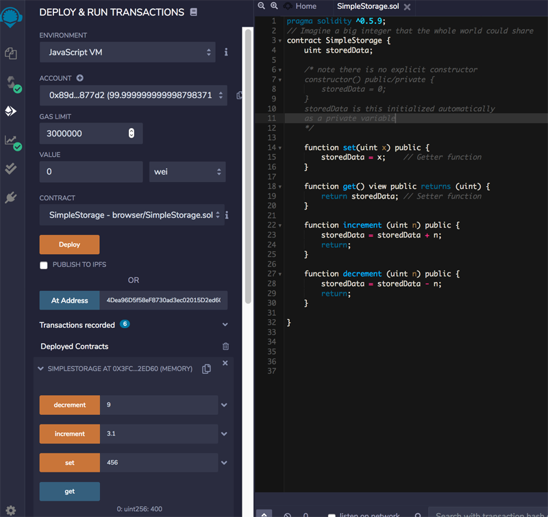

# Ethereum: Smart Contracts
## Week 1
### Introduction
Smart Contracts (SC) are the computational feature of the blockchain technology. The term Smart Contract goes back to [Nick Szabo](http://www.alamut.com/subj/economics/nick_szabo/smartContracts.html). Smart contracts on the Ethereum blockchain are implemented in Solidity language. There is an IDE available for Ethereum Solidity called [Remix](https://remix.ethereum.org).
The smart contract lifts the capabilities of a crypto currency beyond the simple transfer of money. This way rules and policies of arbitrary complexity can be introduced.

A smart contract consists of the following building blocks:
*Pragma driective
*Name of the contract
*Data or State Variables defining the state of the contract
*Collection of functions

### Examples and IDE
The SC equivalent of ‚hello world‘
[greeter.sol](https://gist.githubusercontent.com/GianRothfuchs/fcdaddad12a910040897a0382c9a875d/Greeter.sol)

### Compilation Process
Compile using Environment ‚Java Script VM‘ and Deploy. The compiler creates the following artefacts:
* ABI: Application Binary Interface describes all the functions in the contract
* Contract Bytecode: Bytecode executed during creation of the contract
* WebDeploy script: Eb3 deploy module, containing the script for invoking the SC from a web application (copy/paste to JavaScript console to deploy the SC).
* Gas estimate: estimates of gas required for function call
* Function hashes: quick reference to functions
* Instance Bytecode: actual runtime bytecode of the SC Address of smart contract. 

### Deployment Process and Artefacts
SC is written in high level language like Solidity and then compiled into bytecode. The ABI (Application Binary Interface) enables other web apps to interact with the SC. The Ethereum Virtual Machine (EVM) provides an execution environment for SC bytecode. 
The SC needs to have an address, to make it tragetable for transactions. The address is generated by hashing the senders address and its nonce, resulting in unique address for SC creation and deployment. Target account 0 is targeted to create a new SC from the payload of a transaction. The transaction carries the bytecode of the SC in the payload field. The exection of a SC creation process, results in the deployment of the SC to the EVM. This way the SC is deployed to all full nodes in the Ethereum network. 
To interact with a SC the account address, the ABI definition, and the function hashes are  required

## Week 2: Solidity
A SC’s format is similar the class definition in Object Oriented Programming. 

### Elements of Solidity
Elements:
* Data or State Variables
* Functions: Constructor, Fallback, View, Pure, Public, Private, Internal, External
* User defined types and enums
* Modifiers
* Events

Inheritance works like this:
contract CatContract {..}

contract AnimalContract is CatContract {
//special policies for cats
}
This way CatContract inherits all policies that apply for AnimalContract.

Function header definition:
* Basic Header: 
	function header {//code}
* Full Header: 
  function nameOfFunction (params) visibilityModifier accessModifier returns (returnParams) {//code} 
param is a pair type/identifier (i.e. uint counter), returnParams it’s the same when only type is specified there has to be return statement.
* Function Return: multiple returns can be defined (age,gender) = getAgeGender();
	

### Data Types and Statements
There is an extensive Documentation on [Data Types](https://solidity.readthedocs.io/en/develop/types.html) in Solidity. The [Bidder.sol](https://gist.github.com/GianRothfuchs/fa176dd2bd39471eefbebdc2d5b38f42#file-bidder-sol) SC shows the basics of data types and getter and setter functions.

### Data Structures and Events
1. Address is a special solidity composite data type. It holds a 20-byte Ethereum Address. It also contains the Balance of the Address stated in Wei and it also supports a function Address.tranfer(uint256 amount) to transfer an amount of Wei to the Address.
2. Mapping is a key/value store. Key is often an Ethereum address, the value can be any data type. Example: mapping (uint address => customer) custData;
3. Message is a complex dataytpe. This is the call to invoke a function of a smart contract. It has many attributes amongst them there are: address adr = msg.sender; uint amt = msg.value (in Wei).

The code [Minter.sol](https://gist.github.com/GianRothfuchs/fa176dd2bd39471eefbebdc2d5b38f42#Minter-sol) make use of the Mapping and Address feature discussed above. In Addition that the handling of events is also demonstrated with a simple example.

### Struct, Array, and Time Units
* Struct is a structure containing related data. Refer to the [Ballot.sol](https://gist.github.com/GianRothfuchs/fa176dd2bd39471eefbebdc2d5b38f42#file-ballotbasic-sol) for an code example. For example 
  struct voter {uint weight;
		bool voted;
		uint8 vote;
		}
  
* Time Units are expressed as Unix Epoch Time. The Solidity specific now reveals the confirmation time of the block.
* Enum helps to define states or phases of a contract. A use case for enum as a state definition can be found in [BallotWithStages.sol](https://gist.github.com/GianRothfuchs/fa176dd2bd39471eefbebdc2d5b38f42#file-ballotwithstages-sol)

### Security and Stability
* Function modifiers. Defined at the beginning of a function and execute before the execution of the function. Modifier checks a condition using a require clause. In combination with a revert function a transaction will be rejected and all its state changes are reverted, there will be no recording on the blockchain. Example definition of a modifier:
modifier onlyBy(address _account) {
					require(msg.sender == _account);
					_; // this is important!
				   }
Use the modifier in the function like this:
function register(address toVoter) public onlyBy(chairperson) {// code}
An in-function implementation of this check would be something like:
if (msg.sender == _account) {return;}
* Assert declaration can also handle errors at the end of a function execution and can also be combined with the revert clause.

## Week 3: Development
* Events. The main difference to a function calls, the information of the event is pushed to client applications. The client can listen to pushed events by using listener code. This is vital for the development of decentralised Apps (dApps).
* revert txn

